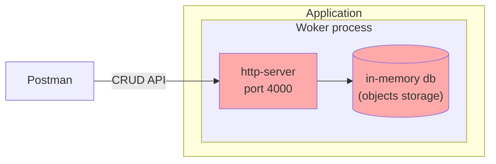
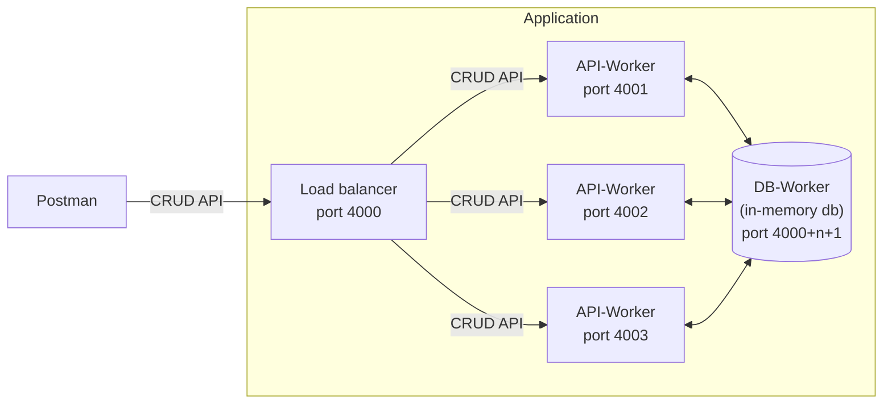

# nodejs-curd-api

Educational project for rs.school (NodeJS)

## Task #3

Implement simple CRUD API

Assignments: [CRUD API](https://github.com/AlreadyBored/nodejs-assignments/blob/main/assignments/crud-api/assignment.md)

[Scoring](https://github.com/AlreadyBored/nodejs-assignments/blob/main/assignments/crud-api/score.md)

Time limits: start `2023-01-10 03:00` end `2023-01-17 03:00` (UTC+3)

## Installation

Prerequisites:
* nodejs 18 LTS
* npm
* typescript
* git

How to install:
1. Clone the repository with `git clone <repo>` and checkout `crud-api` branch with `git checkout crud-api`
2. Install dependencies with `npm i`
3. Copy and rename file `.env.example` to `.env`

## Start

There is a set of project startup scripts.
* `npm run start:dev` starts `nodemon` tool to helps develop by automatically restarting the application when file changes in the sources are detected.
* `npm run start:prod` builds the application into a single bundle file `dist/bundle.js` using `webpack` and then runs that bundled file with `node dist/bundle.js`.
This is the single process application mode. A single nodejs process runs an http server to listen for CRUD requests, as well as hosts an in-memory embedded database.

* `npm run start:multi` is the same as `start:prod` but runs the bundle with the `--multi` option to demonstrate horizontal scaling mode.
This is a multi-process application mode. The initial nodejs process runs the load balancer. It also forks into several API worker processes and one separate database process.

* `npm run test` runs several unit tests and three API integration tests scenarios with `supertest`.

In addition, there are a few more helper startup scripts:
* `npm run build:tsc` builds projects from typescript into commonjs files. It helps to see how modules are translated into js.
* `npm run start:ts-prod` runs the application directly on the typescript sources without explicit translation to js.
* `npm run start:ts-multi` the same with cluster mode.

## CRUD API

The application implements the endpoints required by the task:

* **GET** `api/users` is used to get all users.
* **GET** `api/users/{userId}` is used to get the user by id.
* **POST** `api/users` is used to create record about new user and store it in database.
* **PUT** `api/users/{userId}` is used to update existing user.
* **DELETE** `api/users/{userId}` is used to delete existing user from database.

The postman request collection `RSS CRUD API.postman_collection.json` will help you try the endpoints and see how the application works in detail.
